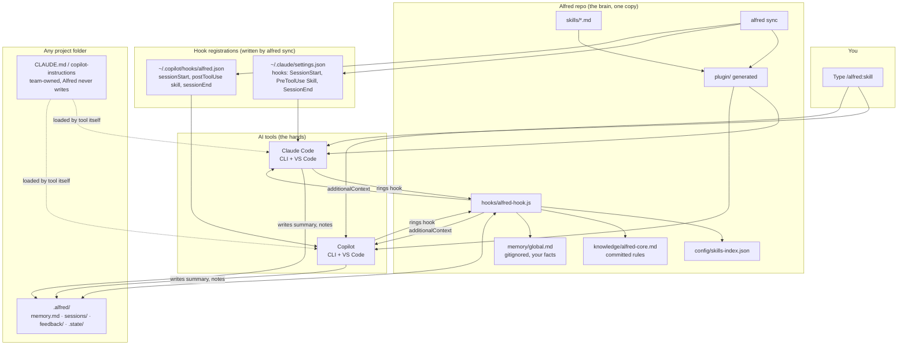
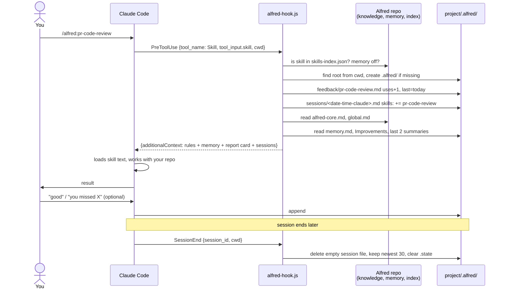
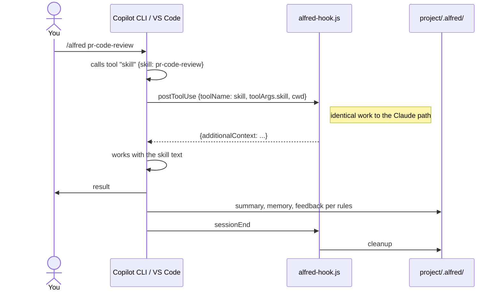
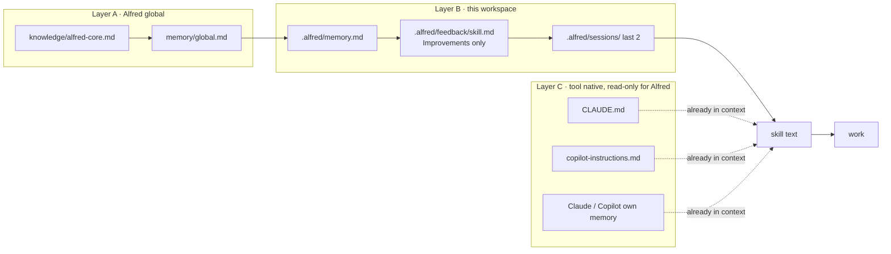
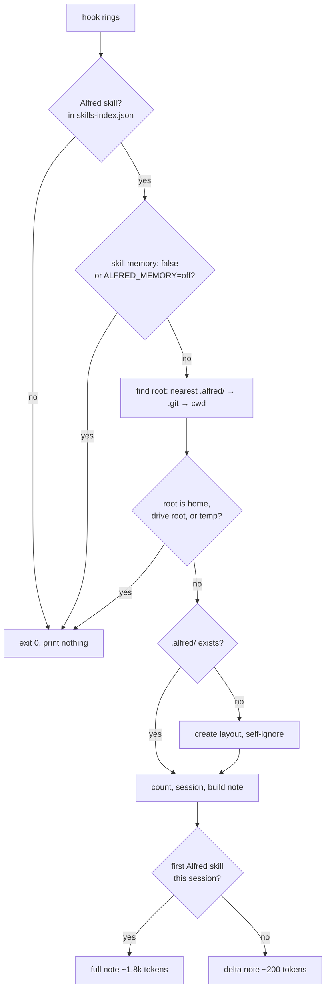
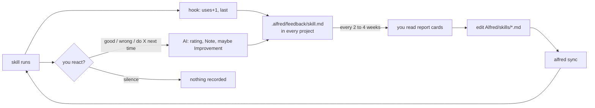
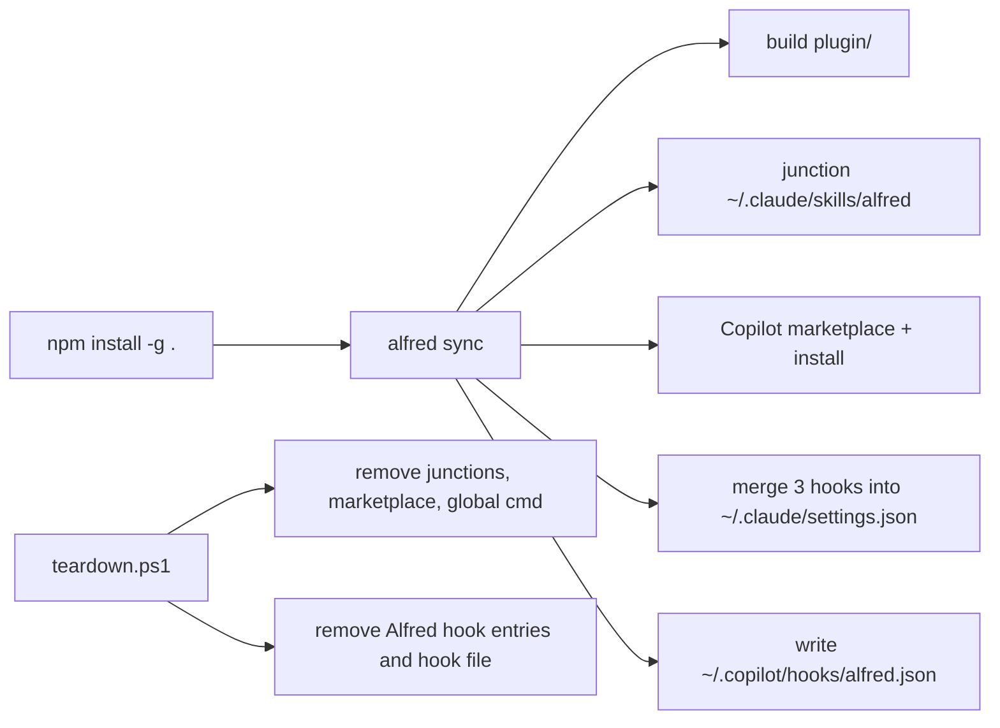

# 05. System design (mermaid), pros and cons, confidence

## 1. Components and how they connect

## 2. One skill call, Claude Code

## 3. Same call, Copilot (only the event names differ)

## 4. Memory layers and read order

Priority while an Alfred skill runs: A and B over C, stated in `alfred-core.md`. Outside
Alfred skills, nothing is injected and C behaves as usual.

## 5. Decision tree inside the hook (why memory is not created everywhere)

## 6. Feedback loop

## 7. Install and uninstall path

`alfred sync` stays the only command a user runs. Idempotent: run twice, same result.

## Pros and cons, your way of thinking

Pros

- One command, zero configuration. Memory appears where you work, hides from git.
- Same notebook for Claude and Copilot. The Monday-Claude, Tuesday-Copilot amnesia
  problem is gone for anything Alfred skills touch.
- Skills stay pure instructions. No skill needs to know about memory. New skills get it
  for free. Old hacks (`~/.claude/ship-pr/*.txt`, hardcoded Alfred path) can move into
  memory lines.
- Small by design: caps, one-line facts, empty sessions deleted, once-per-session
  injection. Costs less context than one skill file.
- Feedback numbers you can trust, because the only counters the machine writes are
  the ones it can know.
- Everything is plain text on your disk. Readable, diffable, deletable by hand.
- Fits the roadmap: this is items 4, 1, 6 together, and it prepares 9 (handoff) and 11
  (gated self-improvement) without building them.

Cons and open risks

- Copilot in VS Code may ignore user hooks on its bundled runtime. Test first. Worst
  case: VS Code Copilot reads files other sessions wrote, but does not get automatic
  injection until VS Code updates.
- Priority over CLAUDE.md is an instruction, not a lock. Rare conflicts are flagged,
  not prevented.
- Writing back depends on the AI obeying the rules. Expect occasional skipped
  summaries. Acceptable; a missing summary is cheaper than a nagging hook.
- One more memory location next to Claude's own auto-memory and CLAUDE.md. Kept
  narrow on purpose, but it is a fourth place.
- `git clean -fdx` wipes `.alfred/`. Operational memory, so acceptable; export later
  if it hurts.
- Two parallel sessions in one project can overwrite each other's memory line. Low
  damage, not worth a lock yet.
- Hook adds 100 to 200 ms per Alfred skill call. Not noticeable.

## Confidence per building block

| Block | Confidence | What would change it |
|---|---|---|
| Hook script, root detection, folder creation, counters | 95% | Pure Node fs work, no unknowns |
| Claude Code hooks via `settings.json`, CLI and VS Code | 95% | Already proven by caveman on this machine |
| Claude `PreToolUse` on `Skill` injecting `additionalContext` | 85% | Documented, one test confirms |
| Copilot CLI `postToolUse` on `skill` injecting `additionalContext` | 80% | Documented, one test confirms |
| Copilot user hooks read by VS Code's bundled runtime | 45% | The single real unknown; test in the first hour |
| Memory stays small and useful over months | 70% | Depends on rules text quality; caps catch the rest |
| Feedback becomes useful evidence for skill edits | 65% | Needs a few weeks of real use |
| Whole thing ships as MVP in one focused build | 85% | About 200 lines of hook, 40 lines of rules, small edits to two integration files |

## Build order (smallest first)

1. `hooks/alfred-hook.js` with `skill-start` only, Claude Code only, wired by hand in
   `settings.json`. Prove injection and folder creation. One hour.
2. Copilot CLI: write `~/.copilot/hooks/alfred.json` by hand. Prove `postToolUse`.
   Then test VS Code Copilot and record the answer. One hour.
3. `knowledge/alfred-core.md` and `memory/global.md`. Read a real skill run's output
   and tighten the rules once.
4. `session-start`, `session-end`, pruning.
5. Move the hand wiring into `alfred sync` and `teardown.ps1`. Update README and
   alfred-reference.
6. Use it for two weeks. Then decide on `alfred feedback`, tags, and the rest.
